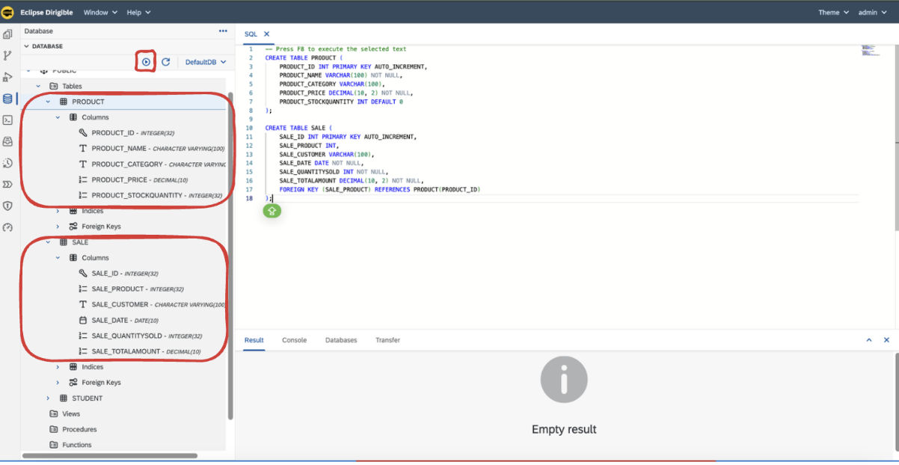
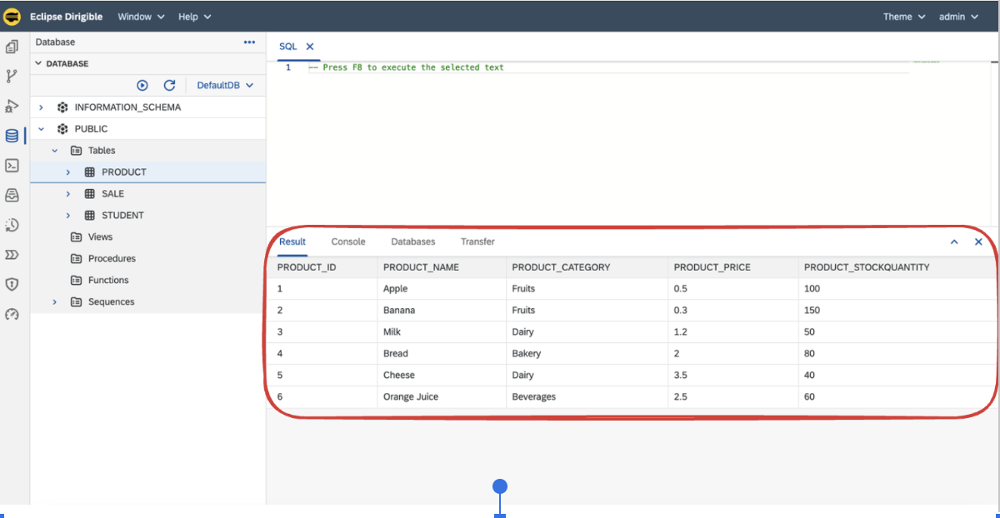
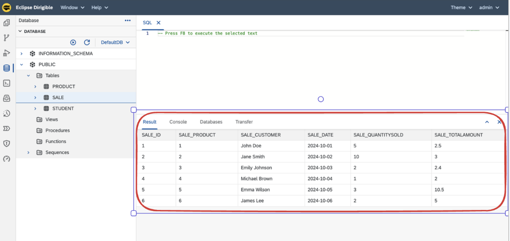
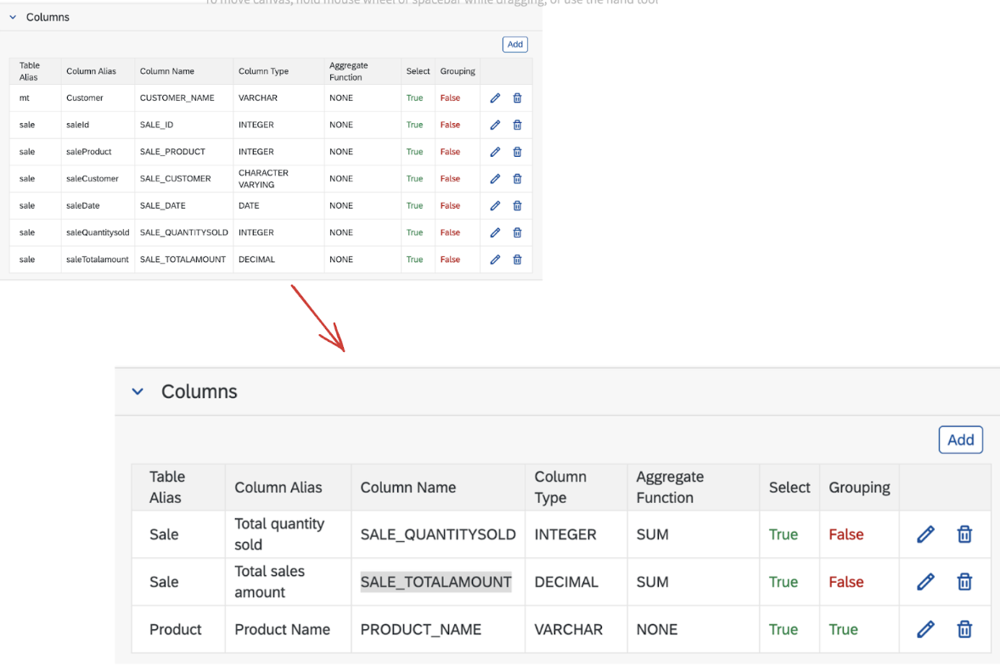
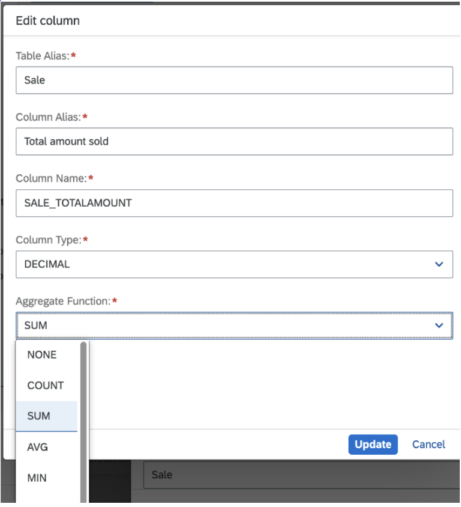
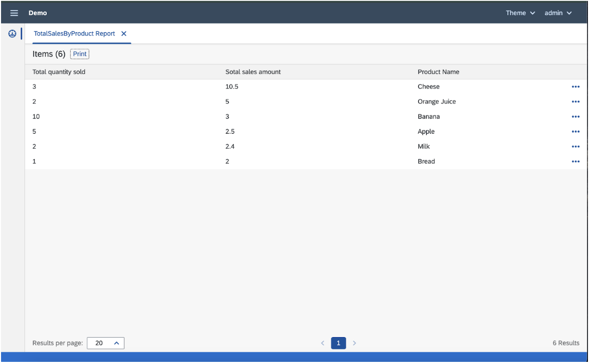
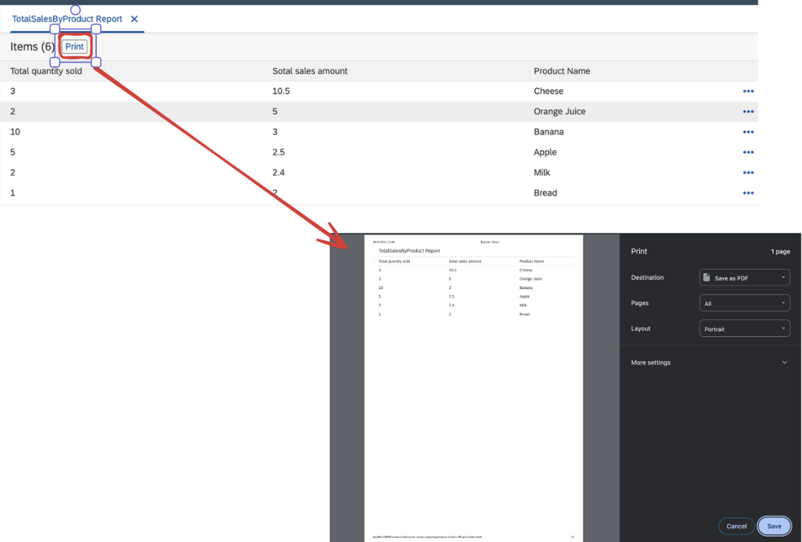
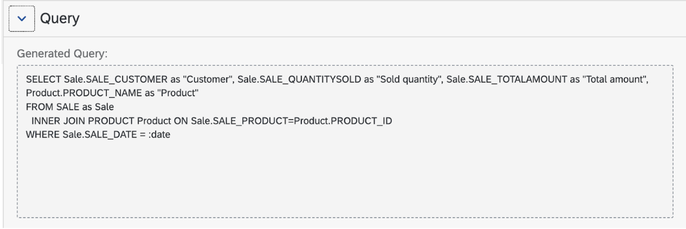
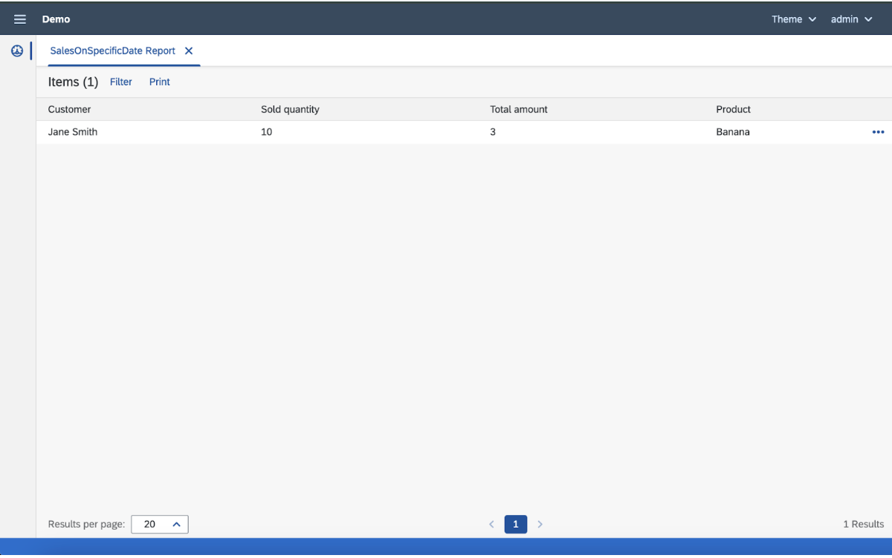
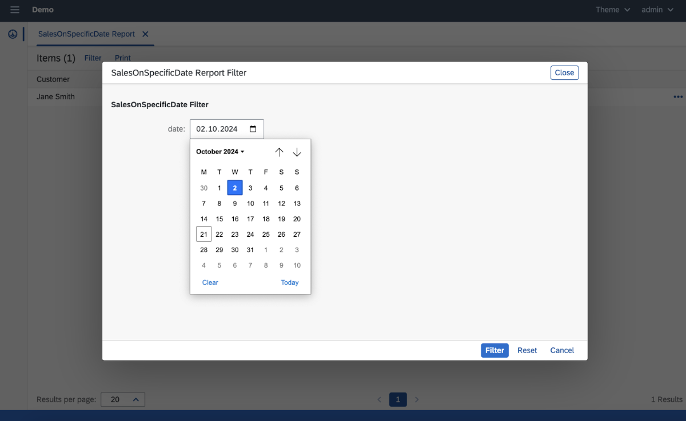

# Reports in Eclipse Dirigible
This sample demonstrates how to create a basic application with reports. It includes database tables, report queries, and the report model itself.

## Sections:

 * Database tables
 * Queries
 * Report models

 1. **Database tables** - this section shows how to create the database tables for the Reports application.

 - Create a project named `reports-sample-project`.

 - Navigate to the `Database Perspective`.

 - In the `SQL View` enter the following script:
 
```sql
       CREATE TABLE PRODUCT (
       PRODUCT_ID INT PRIMARY KEY AUTO_INCREMENT,
       PRODUCT_NAME VARCHAR(100) NOT NULL,
       PRODUCT_CATEGORY VARCHAR(100),
       PRODUCT_PRICE DECIMAL(10, 2) NOT NULL,
       PRODUCT_STOCKQUANTITY INT DEFAULT 0);

       CREATE TABLE SALE (
       SALE_ID INT PRIMARY KEY AUTO_INCREMENT,
       SALE_PRODUCT INT,
       SALE_CUSTOMER VARCHAR(100),
       SALE_DATE DATE NOT NULL,
       SALE_QUANTITYSOLD INT NOT NULL,
       SALE_TOTALAMOUNT DECIMAL(10, 2) NOT NULL,
       FOREIGN KEY (SALE_PRODUCT) REFERENCES PRODUCT(PRODUCT_ID));
```

<br>

- Press the `Run` icon to execute the SQL script.

- Press the `Refresh` button to see the `PRODUCT` and `SALE` tables.

<br>

**Table content**

-  Right-click on the `PRODUCT` or `SALE` tables and select `Show Contents`.

- The table data would be displayed in the `Result View`.
 
- As the table is empty, there should be no data:

<br>

-  In the `SQL View` enter the following script:

```sql
       INSERT INTO PRODUCT (PRODUCT_NAME, PRODUCT_CATEGORY, PRODUCT_PRICE, PRODUCT_STOCKQUANTITY) VALUES
       ('Apple', 'Fruits', 0.50, 100),
       ('Banana', 'Fruits', 0.30, 150),
       ('Milk', 'Dairy', 1.20, 50),
       ('Bread', 'Bakery', 2.00, 80),
       ('Cheese', 'Dairy', 3.50, 40),
       ('Orange Juice', 'Beverages', 2.50, 60);
 
       INSERT INTO SALE (SALE_PRODUCT, SALE_CUSTOMER, SALE_DATE, SALE_QUANTITYSOLD, SALE_TOTALAMOUNT) VALUES
       (1, 'John Doe', '2024-10-01', 5, 2.50),
       (2, 'Jane Smith', '2024-10-02', 10, 3.00),
       (3, 'Emily Johnson', '2024-10-03', 2, 2.40),  
       (4, 'Michael Brown', '2024-10-04', 1, 2.00),
       (5, 'Emma Wilson', '2024-10-05', 3, 10.50),
       (6, 'James Lee', '2024-10-06', 2, 5.00);
```

-  Press the `Run` icon to execute the SQL script.

-  Right-click on the `PRODUCT` or `SALE` tables and select `Show Contents`. You should see the data inside.

<br>

<br>

2. **Queries** - The next step is to define the purpose of your reports. It’s essential to create your queries early and verify that they function correctly. You can test this by pasting them into the Database perspective and ensuring they run without errors.

- `Total sales by product`

```sql
        SELECT P.PRODUCT_NAME,
        SUM(S.SALE_QUANTITYSOLD) AS TOTAL_QUANTITY_SOLD,
        SUM(S.SALE_TOTALAMOUNT) AS TOTAL_SALES_AMOUNT
        FROM SALE S
        JOIN PRODUCT P
        ON S.SALE_PRODUCT = P.PRODUCT_ID
        GROUP BY P.PRODUCT_NAME 
        ORDER BY TOTAL_SALES_AMOUNT DESC;
```

- `Sales on a specific date`

```sql
        SELECT P.PRODUCT_NAME, S.SALE_CUSTOMER, S.SALE_QUANTITYSOLD, S.SALE_TOTALAMOUNT
        FROM SALE S
        JOIN PRODUCT P
        ON S.SALE_PRODUCT = P.PRODUCT_ID
        WHERE S.SALE_DATE = :parameter;
```

<br>

3. **Report models**

#### Total sales by product


     1. Right click on the Project -> New -> Report Model.

     2. Open the report-model.report file and assign a name to the report.

<br>

     3. Select the main table for the report; in our case, it’s SALE.

<br>
     
     4. In the columns section, remove any columns you don’t want to include in the report and set the aggregate functions.

<br>

<br>

     5. In the Joins section, define the joins by specifying their type and conditions.

<br>

     6. In the Ordering section, specify the column and the order for displaying the results.

<br>


     7. After completing these steps, a query is generated for the report. You can review it and make any necessary adjustments, adding or removing elements as needed.

<br>

     8. Report generation
         - Right click ot .report file and choose generate 

<br>

         - Choose Application Report - Table for template and enter needed information in the next dialog

<br>

<br>

         - Publish the project

<br>

         - Open the index.html and view the report

<br>

<br>

         - You can also print the report 

<br>

-------------------------
 
#### Sales on a specific

      1. Right click on the Project -> New -> Report Model.
      
      2. Open the report-model.report file and assign a name to the report.

<br>

      3. Select the main table for the report; in our case, it’s SALE.

<br>

      4. In the columns section, remove any columns you don’t want to include in the report.

<br>

      5. In the Joins section, define the joins by specifying their type and conditions.

<br>

      6. In the Conditions section, define the criteria for filtering the results..

         Note: ':date' is dynamic parameter which will be configured in step 7

<br>

      7. In the Parameters section, specify their names, types, and initial values.

<br>

      8. After completing these steps, a query is generated for the report. You can review it and make any necessary adjustments, adding or removing elements as needed.

<br>

      9. Report generation
         - Right click ot .report file and choose generate 

<br>

         - Choose Application Report - Table for template and enter needed information in the next dialog

<br>

<br>

         - Publish the project

<br>

         - Open the index.html and view the report

<br>

<br>

         - You can now filter by date

<br>

-------------------------


