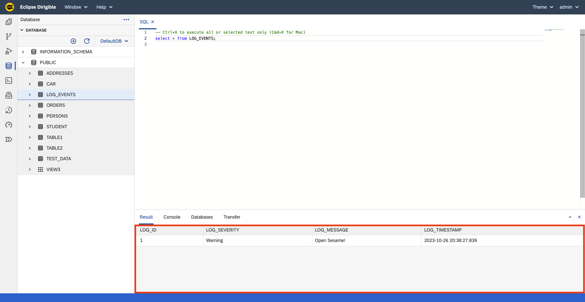

Scheduled Job - Job Handler
===

## Overview

This section shows how to create helper `Logger` class to create log events and `Job Handler` that would be executed by the `Scheduled Job`.

## Steps

### Logger

1. Right click on the `scheduled-job-project` project and select **New &#8594; TypeScript Service**.
1. Enter `Logger.ts` for the name of the TypeScript Service.
1. Replace the content with the following code:

    ```ts
    import { update } from "@dirigible/db";

    export enum LogDataSeverity {
        INFO = 'Info',
        WARNING = 'Warning',
        ERROR = 'Error'
    }

    export interface LogData {
        readonly date: Date;
        readonly severity: LogDataSeverity;
        readonly message: string;
    }

    export class Logger {

        public static log(logData: LogData) {
            Logger.saveLogEvent(logData);

            const message = `---> [${logData.severity}] [${Logger.toDateString(logData.date)}]: ${logData.message} <---`;
            switch (logData.severity) {
                case LogDataSeverity.INFO:
                    console.info(message);
                    break;
                case LogDataSeverity.WARNING:
                    console.warn(message);
                    break;
                case LogDataSeverity.ERROR:
                    console.error(message);
                    break;
            }
        }

        private static saveLogEvent(logData: LogData) {
            const sql = `insert into LOG_EVENTS ("LOG_SEVERITY", "LOG_MESSAGE", "LOG_TIMESTAMP") values (?, ?, ?)`;
            const queryParameters = [logData.severity, logData.message, logData.date];

            update.execute(sql, queryParameters, null);
        }

        private static toDateString(date: Date): string {
            return `${date.toLocaleDateString()}; ${date.toLocaleTimeString()}`;
        }
    }
    ```

!!! tip "db/update"

    Take a look at the [`db/update`](https://www.dirigible.io/api/database/update/) documentation for more details about the API.

### Logger

1. Right click on the `scheduled-job-project` project and select **New &#8594; JavaScript ESM Service**.
1. Enter `handler.mjs` for the name of the JavaScript Service.
1. Replace the content with the following code:

    ```js
    import { Logger, LogDataSeverity } from './Logger';

    const logData = [{
        date: new Date(),
        severity: LogDataSeverity.INFO,
        message: 'Success feels so good!'
    }, {
        date: new Date(),
        severity: LogDataSeverity.INFO,
        message: 'You made it!'
    }, {
        date: new Date(),
        severity: LogDataSeverity.WARNING,
        message: 'Open Sesame!'
    }, {
        date: new Date(),
        severity: LogDataSeverity.WARNING,
        message: 'Password updated!'
    }, {
        date: new Date(),
        severity: LogDataSeverity.ERROR,
        message: 'Welcome to the dark side!'
    }, {
        date: new Date(),
        severity: LogDataSeverity.INFO,
        message: 'So glad you are back!'
    }];

    const randomIndex = Math.floor(Math.random() * logData.length);

    Logger.log(logData[randomIndex]);
    ```

1. Navigate to the [`Database Perspective`](/help/development/ide/perspectives/database/) to check that there is a record in the `LOG_EVENTS` table.



!!! info "Save & Publish"
    
	Saving the file will trigger a _`Publish`_ action, which will build and deploy the **JavaScript** and **TypeScript** services. The `handler.mjs` service would be executed by the `Preview` view. As it's expected to be executed by a **Scheduled Job** and not by `HTTP Request` nothing would be displayed in the `Preview` view, however the log event data would be insterted into the `LOG_EVENTS` table.


!!! warning "JavaScript ESM Handler"

    At the time of writing the tutorial, it was not possible to create a `TypeScript` handler for the `Scheduled Job`.

## Next Steps

!!! success "Section Completed"

    After completing the steps in this tutorial, you would have:

    - `Job Handler` and `Logger` class to create log events.
    - At least one record in the `LOG_EVENTS` table.

    Continue to the [Job Definition](../job/) section to create a `Scheduled Job`, that would trigger the `Job Handler`.

    _**Note:** The complete content of the Scheduled Job tutorial is available at: [https://github.com/dirigiblelabs/tutorial-scheduled-job-project](https://github.com/dirigiblelabs/tutorial-scheduled-job-project)_